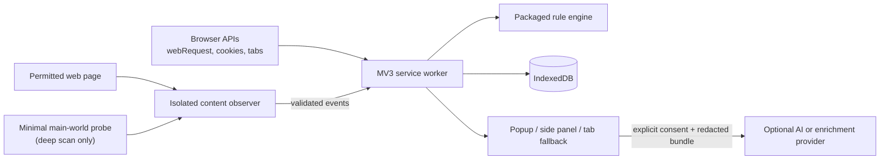
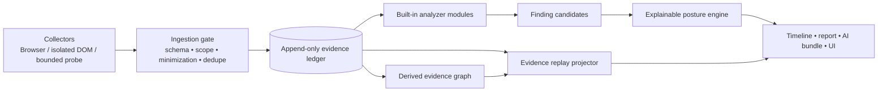
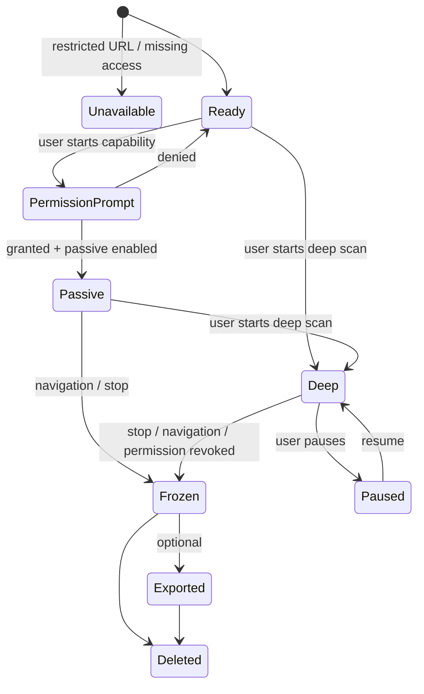

# BrowserScope — System and Extension Architecture

## 1. Context



The service worker is the authority for sessions, capability state, normalization, rule evaluation, persistence, and UI snapshots. Neither the page probe nor the UI can write directly to the database.

## 2. Extension contexts

| Context | Responsibilities | Must not do |
|---|---|---|
| Service worker | permission orchestration, webRequest/cookie listeners, session state machine, event batching, rules, DB transactions, remote request broker | retain authoritative state only in globals; parse page HTML; render UI |
| Isolated content observer | DOM metadata, navigation/frame lifecycle, safe bridge to probe | inspect/retain content values; expose extension APIs to page |
| Main-world probe | best-effort hooks for selected APIs after deep-scan start | hold secrets; trust page objects; provide a general message/RPC endpoint |
| Popup | status, quick posture, Scan button, capability education | render unbounded event data |
| Side panel / tab fallback | session detail, timeline, search, export, data controls | decide rules or handle privileged browser events |
| Offscreen document (only if needed) | worker-hosted computation incompatible with SW only after a measured need | keep a permanent background loop |

`chrome.debugger` is deliberately outside the core data flow. It may become an Advanced capability adapter only after dedicated UX and platform review. The API attaches a DevTools Protocol client to a tab and requires the `debugger` permission; it is therefore materially more sensitive than passive metadata collection. [Chrome debugger](https://developer.chrome.com/docs/extensions/reference/api/debugger)

## 2a. Evidence-event pipeline (revision 2)



The ingestion gate is the sole writer of primary events. It performs source-specific validation, scope/permission check, prohibited-field stripping, canonicalization, source-time normalization, and idempotency. The ledger is append-only after a session freezes. Derived state is deliberately disposable and regenerable from a frozen ledger plus versioned rules.

### Built-in analyzer boundary

Analyzers are compiled, first-party modules satisfying a narrow contract: `accept(event batch, read-only investigation context) → observations, finding candidates, graph-edge candidates`. They cannot call `chrome.*`, make HTTP requests, mutate UI state, persist records, or inspect raw page objects. An `AnalyzerHost` budgets execution time and event count, validates output, and attaches evidence IDs before persistence.

Initial modules are Navigation, Network, Header/CSP, DOM Metadata, Cookie Metadata, Storage Metadata, Permission/API Invocation, Worker/Service Worker, Fingerprinting Pattern, and OAuth Pattern. “Extension Analyzer,” Accessibility, and Performance are deferred: their names imply unsupported/broader collection and must first define measurable evidence and permissions.

## 3. Session state machine



Navigation creates a new document segment in the same user-visible scan only when the top-level origin remains eligible; otherwise it freezes the session and presents a new Scan action. Every transition emits a system event.

## 4. Data flow

1. The action click resolves current tab eligibility and asks for minimum capability permission.
2. The service worker creates a session and writes its durable descriptor before registering collection.
3. Browser listeners and content observer produce source-specific raw events. The page probe communicates only through the content observer.
4. `EventNormalizer` canonicalizes URL/origin, strips prohibited fields, validates schema, assigns sequence/time, and resolves request/frame references.
5. `EventStore` writes event batches transactionally to IndexedDB. `RuleEngine` evaluates only normalized events and emits findings with evidence IDs.
6. `SessionProjector` produces compact aggregate snapshots for the popup/panel. UI detail pages page through local data.
7. Export/AI invokes `RedactionPipeline` over a fixed snapshot. It never reads the raw object by bypassing the pipeline.

### Event delivery guarantees

- At-least-once internal delivery; idempotency key is `(sessionId, source, sourceEventId, phase)`.
- Ordered display by `(monotonicTime, sequence)`; browser times may be corrected only for display.
- A browser service-worker restart can cause an explicit `coverage_gap` event but must not duplicate final events.
- Backpressure emits summary/overflow events, increments coverage loss, and stops the noisiest collector rather than silently losing arbitrary data.

## 5. Package structure

```text
BrowserScope/
  docs/
  src/
    entrypoints/
      background.ts
      content.ts
      main-world-probe.ts
      popup/
      sidepanel/
      inspector-tab/
    core/
      capabilities/       # browser-specific feature adapters
      sessions/           # state machine and authority
      events/             # schemas, normalizers, event bus
      evidence/           # immutable references and projection
      rules/              # declarative rules, evaluator, explanations
      risk/               # category posture calculation
      privacy/            # canonicalization, minimization, redaction
      storage/            # IndexedDB repositories/migrations
      export/
      ai/                 # consent, bundle, provider contract
    ui/
      components/
      features/
      styles/
    shared/
      contracts/
      browser/
      observability/
  rules/                  # packaged, schema-validated rule data
  tests/
    unit/ integration/ e2e/ fixtures/
  public/
  wxt.config.ts
  package.json
```

Dependencies flow inward only: `entrypoints → ui/core → shared`; `core` cannot import UI. Browser APIs are isolated behind `shared/browser` and `core/capabilities`, which makes unsupported-feature messaging testable.

## 6. Plugin system: governed rules, not arbitrary code

Do **not** add a runtime JavaScript plugin system. It conflicts with MV3’s packaged-code model and would turn a security extension into a code-execution supply-chain risk.

The v2 extension point is a signed, declarative **Rule Pack**:

```text
manifest: pack id, version, publisher key id, minimum schema/app version
rules: event predicates, bounded aggregations, severity/confidence, explanation template ids
locales: static display strings
tests: fixtures + expected findings
signature: detached signature over canonical pack archive
```

Rule packs cannot call network, access storage, run regexes with unbounded complexity, alter collection, or render HTML. Third-party packs require user installation, visible publisher identity, review state, signature verification, capability declaration, and isolated test fixtures. Initial releases ship only first-party packs.
