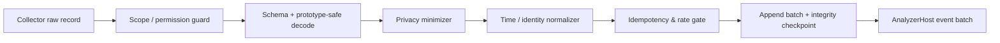

# BrowserScope — Event Engine and Analyzer Runtime

**Status:** revised architecture baseline. This is a design contract, not implementation code.

## 1. Purpose and invariants

The Event Engine converts a permitted, scoped set of browser/document/probe observations into a durable evidence ledger. Its purpose is reproducibility: given the same frozen ledger, analyzer-pack manifest, and settings, BrowserScope produces the same timeline, graph, and posture result.

Invariants:

1. Primary events are immutable, append-only, and never authored by AI or an analyzer.
2. Every derived object has input event IDs, algorithm/rule version, and derivation time.
3. Ingestion refuses data outside investigation scope or the privacy allowlist.
4. No ordering assumption crosses browser API source boundaries. A sequence is an ingest order; a relation must state its basis.
5. Coverage gaps are primary evidence—not an error swallowed by telemetry.

## 2. Collector registry

Collectors are first-party adapters. They declare a capability, scope support, emitted event kinds, privacy contract, rate budget, and browser support matrix before registration. They do not create findings.

| Collector            | Direct output                                                    | Scope/permission                         | Important limitation                                                                              |
| -------------------- | ---------------------------------------------------------------- | ---------------------------------------- | ------------------------------------------------------------------------------------------------- |
| Navigation           | before/commit/complete/fail, SPA history and fragment update     | `webNavigation`; selected permitted tabs | Browser network and navigation event ordering is explicitly undefined; BFCache changes lifecycle. |
| Network metadata     | lifecycle, resource class, origin, redirect, status/header facts | `webRequest` + hosts                     | No response body; no comprehensive final headers; not an intent detector.                         |
| Document lifecycle   | DOM ready/load, meta/iframe/script/form structural metadata      | content script + host                    | Starts after injection; no restricted frames/pages; no content/values.                            |
| DOM summary          | coalesced structural mutation events                             | content script + host                    | May be high volume; sampled/coalesced; no innerHTML/text.                                         |
| Main-world API probe | selected API invocation facts                                    | explicit deep scan + host                | Best effort from injection onward; page can evade/interfere; no arguments/return values.          |
| Cookie metadata      | set/change/removal and attributes                                | `cookies` + hosts                        | Does not prove page read/access; values discarded.                                                |
| Storage metadata     | names/key-change metadata/API calls                              | eligible document or probe               | No universal IndexedDB/cache mutation feed; no stored values.                                     |
| Download metadata    | started/state/danger classification                              | `downloads`, separately consented        | Browser-wide capability; no filename/path retained by default.                                    |
| Tab context          | selected-tab open/close/activation only                          | `tabs` for sensitive tab fields          | Never silently expands to all browser activity.                                                   |

## 3. Ingestion pipeline



Failure action is explicit: invalid input is dropped with a local diagnostic counter; permission/scope loss creates `coverage_gap`; rate pressure coalesces permitted event kinds then creates `collector_overflow`; storage failure pauses recording and tells the user. It never silently retains prohibited raw data to diagnose a bug.

## 4. Time, identity, and relations

Each source record retains `sourceObservedAt` and is assigned a local monotonic sequence. The UI uses a stable display clock offset per source. The browser documents that navigation timestamps are internally consistent but may be skewed against extension-process time, and there is no defined ordering between webNavigation and webRequest events. [Chrome webNavigation](https://developer.chrome.com/docs/extensions/reference/api/webNavigation)

Event identity is `investigationId + source + sourceEventId + phase`, where unavailable source IDs use a canonical field hash plus a short time bucket. Deduplication never merges two direct facts merely because they share a URL.

Relations must have one basis:

- `direct-reference`: browser IDs/document parent/request redirect pointer establish it.
- `temporal-correlation`: within declared time window and scope; UI says “occurred near.”
- `rule-inference`: deterministic rule matched evidence; UI names the rule.
- `user-link`: local user annotation; not evidence.

## 5. Analyzer model

```text
AnalyzerManifest = id, version, inputKinds, requiredCapabilities,
  maxBatchEvents, maxRunMs, outputSchemas, privacyReviewId

AnalyzerResult = observationCandidates[], findingCandidates[], graphEdgeCandidates[],
  aggregationUpdates[], diagnostics[]
```

The AnalyzerHost invokes analyzers in dependency order over ledger batches, strips undeclared output fields, bounds CPU/memory, and validates references. An analyzer may produce:

- an **observation candidate**, then an approved derived event;
- a **finding candidate** with severity, confidence, explanation-template parameters, and evidence IDs;
- an **edge candidate** with a non-causal basis; or
- an aggregation update.

It may not open a page, use `fetch`, inspect browser APIs, make UI calls, attach global listeners, run arbitrary plugin JavaScript, or alter the ledger.

### Analyzer catalogue and status

| Analyzer                    | Initial status | Output example                                                                  |
| --------------------------- | -------------- | ------------------------------------------------------------------------------- |
| Navigation / Redirect       | MVP            | redirect chain backed by request/navigation IDs                                 |
| Network / third party       | MVP            | grouped external origin summary                                                 |
| Header / CSP                | MVP            | observed header posture / explicit policy issue                                 |
| DOM metadata                | MVP            | hidden iframe or dynamic script structural observation                          |
| Cookie metadata             | 1.5            | attribute posture, change timeline                                              |
| Storage metadata            | 1.5            | metadata container/key-change summary                                           |
| Permission/API invocation   | 2.0            | API invoked after probe installation                                            |
| Fingerprinting pattern      | 2.0            | multi-signal, confidence-bound pattern                                          |
| OAuth pattern               | 2.0            | possible provider redirect flow, not login proof                                |
| Accessibility / performance | research       | must define product-specific evidence and budget first                          |
| Other-extension analyzer    | rejected       | ordinary extensions cannot safely inspect other extension code/messages/traffic |

## 6. Findings and explainability contract

A finding is a versioned explanation of ledger facts, never a fact itself:

```text
Finding = id, analyzerId/version, ruleId/version, titleTemplate,
  severity: info | caution | important | critical,
  confidence: low | medium | high,
  evidenceIds[], limitationIds[], references[], status
```

The rendering order is: observed evidence; what the rule means; benign/common context; limitation; contribution to category posture. A finding cannot add or subtract posture points unless the rule manifest supplies bounded contribution and a reference. Critical language requires direct evidence or a named, current threat-feed source.

## 7. Capability matrix policy

Every UI item resolves runtime capability to `available`, `requires_permission`, `unsupported_browser`, `restricted_page`, `not_in_scope`, or `late_start`. The UI must not show a disabled collector as a completed empty result. Firefox is built from the same contracts but ships a distinct capability matrix and tests; it may return `unsupported_browser` for a Chromium-only source.
