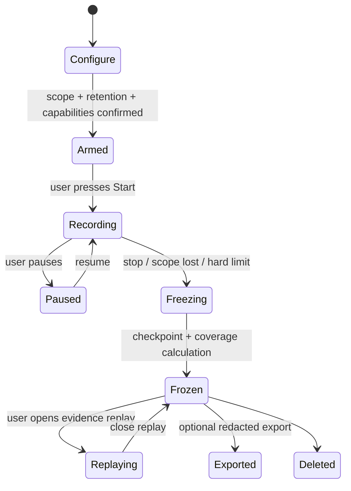

# BrowserScope — Investigations, Graph, Replay, and Reporting

## 1. Controlled investigation lifecycle

The configuration screen defaults to Current tab, a conservative duration cap, and local 24-hour retention. It presents expanded capabilities individually, including their browser warning. Browser-wide laboratory scope is not part of normal onboarding or passive mode. Its configuration must state “records metadata for all eligible tabs during this period,” require an explicit duration, and use a red visual boundary distinct from an ordinary scan.

## 2. Graph model and interaction

The evidence graph is optimized for explanation, not graph-database novelty. IndexedDB stores node and edge projections alongside the ledger, permitting local queries without Neo4j infrastructure.

### Default views

| View | Starting focus | Answer |
|---|---|---|
| Investigation map | Investigation → selected tab → top-level documents | What did this recording cover? |
| Event neighborhood | one event with 1–2 hops | What directly supports or is related to this event? |
| Origin surface | one origin → requests/scripts/cookies/workers | What did this site load or create? |
| Finding provenance | finding → evidence → analyzer/rule | Why is this conclusion shown? |

The graph applies node/edge count budgets and grouping (e.g., one third-party domain node) to avoid a visual hairball. It never uses layout proximity as a semantic relationship. Clicking any node opens evidence IDs and all edges are filterable by direct vs inferred basis.

## 3. Evidence replay

Replay maintains a cursor from sequence 0 to the frozen ledger tail. At cursor `n`, the projector deterministically derives all events ≤ `n`, active graph nodes/edges, aggregates, and findings whose first evidence is ≤ `n`.

| Supported | Explicitly not supported |
|---|---|
| Play/pause, 0.5×–8× speed, seek, event stepping, time-range comparison, graph evolution, finding emergence | Reloading a URL, running page JavaScript, reproducing DOM pixels, restoring cookies/authentication, replaying downloads, messages, media, WebRTC, WebSocket frames, or any network request |

Reprocessing is version-aware: default replay uses the stored analyzer/rule manifest for faithful historical playback. A user may run “compare with current rules,” which produces a separate derived-analysis version and never mutates the original report.

## 4. Reports and export

Stopping an investigation creates a local report with:

1. Scope, exact start/stop, browsers/capabilities, and coverage gaps.
2. An event-count and origin summary linked to timeline filters.
3. Evidence-backed findings, posture contributions, and limitations.
4. Graph provenance for material findings.
5. User annotations, clearly separated from evidence.
6. A redaction manifest and algorithm/rule versions.

Default export is a redacted JSON evidence package and a static HTML/PDF-like rendering generated locally. URLs use the event `resourceRef`, timestamps may be coarse-grained by user choice, and annotations are included only if selected. Export does not include cookie values, page contents, storage values, request/response bodies, credentials, typed input, full filenames, or unredacted remote-AI prompts.

## 5. Milestones revised for timeline-first delivery

| Milestone | Deliverable | Completion gate |
|---|---|---|
| M0: recorder foundation | Investigation descriptor/state machine, event envelope/schema, scope/capability gate, redaction ingestion tests, IndexedDB ledger/checkpoint | Tests demonstrate session recovery, append-only freeze, rejection of forbidden fields, and visible gaps. |
| M1: trustworthy timeline | Current-tab navigation/document/network evidence, virtualized local timeline, filters/search, start/stop/coverage UI | Chrome/Edge corpus confirms no blocking listeners and timeline is explainable without a score. |
| M2: derived explanation | AnalyzerHost, Navigation/Network/Header-CSP analyzers, evidence-linked findings, posture categories, redacted export | Every visible conclusion passes provenance and deterministic replay tests. |
| M3: graph and replay | Graph projections, focused graph UI, annotations, evidence replay, historical-rule manifest | Replay makes zero network/browser/page operations in automated tests. |
| M4: consented depth | Cookie metadata, storage metadata, selected main-world probe families, multi-tab scope | Permission revocation and late-start coverage handling pass; performance budgets pass on noisy SPAs. |
| M5: advanced optional services | Signed declarative rule packs, remote enrichment/AI REB, Firefox matrix | Privacy review approves each data flow; no remote code; provider answers evidence-cite correctly. |

Implementation may begin only at M0 and only after a security/privacy review approves the precise collector manifest and permission text. UI work accompanies a tested collector slice; it does not precede the evidence contract.
